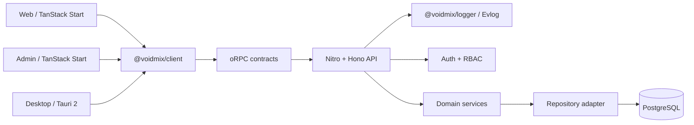

# Architecture Overview

> Status: implemented scaffold, updated August 15, 2026.

Voidmix is a Bun-managed, Vite+ orchestrated TypeScript monorepo for a cloud
web application, an operations console, a Tauri desktop client, and a typed
Nitro + Hono API.

## Design goals

- Keep Web, Admin, Desktop, API, and the UI workbench independently runnable.
- Share contracts, domain rules, UI primitives, and API clients without
  sharing platform-specific route trees.
- Keep server-side business rules behind small, stable interfaces.
- Use Bun for dependency installation and repository scripts while keeping
  Node.js as the initial production server runtime.
- Extract a workspace package only after a stable seam and multiple real
  consumers exist.

## System shape



The API is the business boundary. Web, Admin, and Desktop never access the
database directly.

## Workspace layout

The workspace listing lives in [`README.md`](../../README.md) and, grouped by
dependency direction, in [`AGENTS.md`](../../AGENTS.md); `bun run policy` keeps
both in step with what Bun resolves. [Shared packages](./packages.md) and
[applications](./applications.md) describe each one. Organisation _inside_ a
workspace is covered by [file structure](../development/file-structure.md).

A background worker is deferred until a real asynchronous job needs its own
scheduling, retry, scaling, or deployment; until then no permanently running
process is created for hypothetical work. `features`, `admin-ui`, and a generic
`config` package are intentionally not standalone workspaces either.

Environment validation belongs to `@voidmix/env`; each application assembles its
own application configuration.

## Dependency direction

```text
apps/web      ─┐
apps/admin     ├──> client ───> contracts
apps/desktop  ─┘

apps/storybook ───> ui

apps/api ───> Nitro + Hono + auth + domain + db + contracts
apps/api ───> logger
apps/web/admin/desktop ───> logger (Vite client integration)
apps/api/admin/web/desktop ───> env
packages/db/logger/scripts ───> env
packages/db ───> domain
packages/scripts ───> db + domain + logger
packages/domain ───> auth
```

Rules:

1. Frontend applications never import `@voidmix/db`.
2. `@voidmix/domain` never imports React, Hono, Nitro, or Drizzle.
3. `@voidmix/contracts` performs no network or database work.
4. Every protected Admin operation is authorized by the API.
5. Operational logs never contain raw credentials or session tokens.
6. New shared packages require a stable interface and at least two consumers.

## Detailed documents

- [Applications](./applications.md)
- [Shared packages](./packages.md)
- [Product design](./design.md)
- [Toolchain](./tooling.md)
- [Runtime and deployment](./deployment.md)
- [Decision records](./decisions/README.md)
- [Testing and verification](../development/testing.md)
