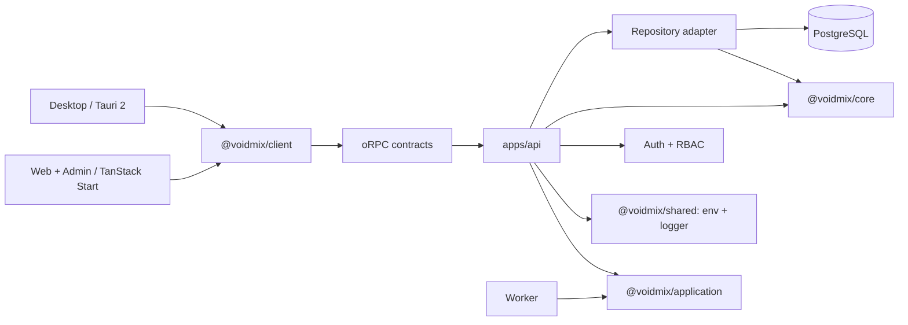

# Architecture Overview

> Status: implemented scaffold, updated September 8, 2026.

Voidmix is a Bun-managed, Vite+ orchestrated TypeScript monorepo for a cloud Web
application with an independent Hono API and operations console, plus a Tauri
desktop client.

## Design goals

- Keep Web, Desktop, API, and the UI workbench independently runnable while
  isolating Admin as a protected Web feature.
- Share contracts, core business rules, UI primitives, and API clients without
  sharing platform-specific route trees.
- Keep server-side business rules behind small, stable interfaces.
- Use Bun for dependency installation and repository scripts while keeping
  Node.js as the initial production server runtime.
- Extract a workspace package only after a stable seam and multiple real
  consumers exist.

## System shape



The API is the business boundary. Web and Desktop never access the database
directly.

The domain language and aggregate boundaries are recorded in the root
[`CONTEXT.md`](../../CONTEXT.md). `@voidmix/core` is the domain-kernel package;
its source is organized by business context rather than by application
features. Application features remain in `apps/web/src/features/` and
`apps/desktop/src/features/`. See [ADR-0008](./decisions/0008-domain-contexts-stay-in-core.md)
for the package and extraction rule.

## Workspace layout

The workspace listing lives in [`README.md`](../../README.md) and, grouped by
dependency direction, in [`AGENTS.md`](../../AGENTS.md); `bun run policy` keeps
both in step with what Bun resolves. [Shared packages](./packages.md) and
[applications](./applications.md) describe each one. Organisation _inside_ a
workspace is covered by [file structure](../development/file-structure.md).

`apps/worker` owns durable Agent and outbox execution. API and Worker share
application commands while remaining independently deployable. `features`,
`admin-ui`, and a generic `config` package are intentionally not standalone
workspaces either.

Environment validation belongs to `@voidmix/shared/env`; each application
assembles and validates its own configuration. Environment and logger APIs are
subpaths of the shared foundation package.

## Dependency direction

```text
apps/web      ─┐
apps/desktop  ─┴──> client ───> contracts

apps/storybook ───> ui

apps/web ───> client ───> contracts ───> apps/api
apps/api ───> Hono + auth + application + core + db + contracts
apps/api ───> shared/env + shared/logger + Hono/oRPC adapters
apps/web/desktop ───> shared/env + shared/logger (Vite client integration)
apps/worker ───> shared/env + shared/logger
apps/api ───> cache
apps/worker ───> application + db + ai
packages/db/mail/cache/scripts ───> shared/env + shared/logger
packages/db ───> core
packages/core/db ───> shared
packages/scripts ───> db + core + shared
packages/core ───> auth
```

Rules:

1. Frontend applications never import `@voidmix/db`.
2. `@voidmix/core` never imports React, Hono, Nitro, or Drizzle.
3. `@voidmix/contracts` performs no network or database work.
4. Every protected Admin operation is authorized by the API.
5. Operational logs never contain raw credentials or session tokens.
6. New shared packages require a stable interface and at least two consumers.
7. Domain rules stay in core; adapters provide storage, AI, mail, processing,
   export, and notification capabilities through explicit ports.
8. Hono owns HTTP and streaming mechanics; oRPC owns typed structured procedure
   contracts. Neither transport layer owns domain rules.

## Detailed documents

- [Applications](./applications.md)
- [Shared packages](./packages.md)
- [Product design](./design.md)
- [Project Studio migration](./project-studio.md)
- [Account-first V2](./account-first-v2.md)
- [Toolchain](./tooling.md)
- [Runtime and deployment](./deployment.md)
- [Decision records](./decisions/README.md)
- [Testing and verification](../development/testing.md)
