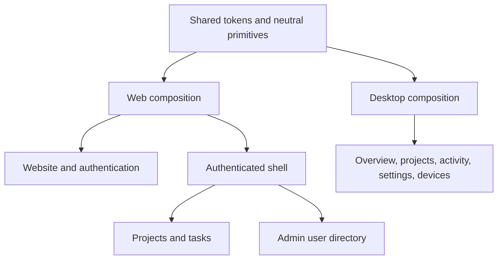

# Product design

Voidmix uses one project-centered visual language across the public website,
authentication, Web and Desktop. [DESIGN.md](../../DESIGN.md) defines the shipped
colors, typography, sizing and page patterns. The future Agent execution vision
in [the delivery goal](./voidmix-delivery-goal.md) is a separate capability roadmap.

## Responsibilities

The shared package owns modal focus, pending-state presentation, accessible
controls and semantic tokens. Applications own navigation and domain labels.
Admin tables, filtering and scoped selection remain private to Web. App shells
are not imported across applications.

Remote entities stay in route loaders, with AbortSignal and invalidation after
writes. URL search retains cursors and Admin filters. The Admin page creates
one non-persisted store per account/page; overlays and form drafts remain local.
Desktop preferences retain their whitelist, migrations and delayed hydration.
No HTTP/RPC contract, persisted schema or date representation changes here.

## Truthful data

Desktop's cloud loader returns either a validated snapshot or an explicit
unconfigured/offline/unavailable state. Health connectivity alone cannot justify
showing overview data. Demo fixtures are imported only by tests. The Activity
route remains compatible with saved URLs but displays an unavailable state;
fixed records and inert export controls are absent.

Admin's count is the API's filtered total. An absent activity signal is unknown,
not "connected". The shell contains no fabricated latency or audit timestamps.
Preferences whose execution is not wired are disabled and labelled unavailable;
stored values survive for compatibility. No new native permissions are granted.

## Product imagery

`e2e/capture-product.ts` seeds dedicated synthetic accounts into the guarded test
database and captures the actual project routes in English and Chinese, both themes and desktop/mobile sizes. Only
loopback servers are used. The resulting WebP images are served locally by Web and
labelled as examples; there are no third-party image or font requests.

## Verification

[Visual audit](../development/visual-audit.md) records viewport coverage, screenshot
provenance and results. Shared primitives have deterministic Storybook examples;
product flows use the real test API and PostgreSQL in Playwright.

## Neutral component baseline

All shipped surfaces use shadcn base-nova Neutral light/dark tokens. One Web
shell serves project lists, details and Admin. The historical beUI route variant
has been retired. Standard shadcn components provide keyboard Tabs, Dialog/Sheet,
Table/Checkbox, ToggleGroup and state presentation. Page layout stays app-local.

[Neutral UI delivery](../development/neutral-ui.md) records migration details,
responsive image generation and verification evidence.
