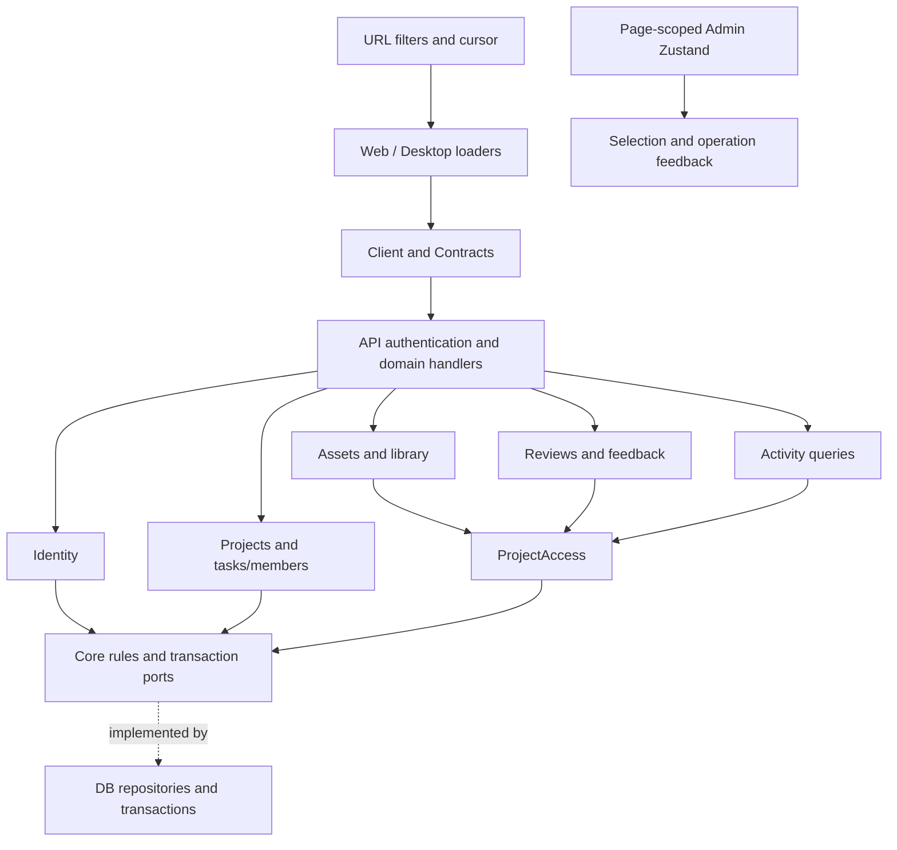

# Domain services and client state

[ADR-0014](./decisions/0014-domain-services-and-client-state.md) assigns workflows
to Application, rules and ports to Core, persistence to DB and transport to API.
The existing Account-first model and physical schema remain unchanged.

## Ownership

| Module   | Application responsibility                                  | Required ports                                       |
| -------- | ----------------------------------------------------------- | ---------------------------------------------------- |
| Identity | Listing, status changes, initial administrator              | User repository with administration transaction      |
| Projects | Lifecycle, tasks, members, capability resolution            | Projects, tasks, project and organization membership |
| Assets   | Assets, versions, existing upload, authorized library query | ProjectAccess, assets, versions, blob storage        |
| Reviews  | Reviews/feedback and version association validation         | ProjectAccess, reviews, feedback, version lookup     |
| Activity | Authorized activity query                                   | ProjectAccess, activity repository                   |
| Settings | Existing decoding, inheritance and Auth/Mail resolution     | Existing settings repositories                       |

Core constructs durable audit events. Application appends them with the mutation
inside a transaction. PostgreSQL locks administration writes with
`pg_advisory_xact_lock(1870034030, 1)`, shared by status changes and bootstrap.
Memory serializes operations and publishes cloned state only after success.
The original guard order and no-op audit behavior remain intact.

Production composition requires every non-Agent service and repository. Missing
wiring fails at construction/typechecking instead of becoming an empty response.
Agent execution, activity event production and new upload protocols remain out
of scope.

## State and transport

| State                                  | Owner and lifetime                                               |
| -------------------------------------- | ---------------------------------------------------------------- |
| Remote entities                        | Route loader; AbortSignal and invalidation after mutations       |
| Filters and pagination                 | Validated URL search; filter changes return to first page        |
| Admin selection, pending IDs, feedback | Page/account DirectoryProvider; no persistence                   |
| Form drafts                            | Local React state                                                |
| Desktop device preferences             | Existing validated, migrated and delayed-hydration Zustand store |
| Theme and language                     | Existing providers                                               |

Admin notices contain message codes and parameters, translated at render time.
Selectors isolate row selection/pending subscriptions. Batch writes specify a
target status and retain partial success counts. Selection, batches and export
are restricted to the current page; filter/page changes clear selection. Disposed
stores reject late results, and new accounts get new stores.

SSR creates a client per request and forwards only Better Auth cookies to the
configured API. Browser requests include credentials. Protected loader data is
tagged with accountId; the layout hides data from another account while clearing
cached protected routes and refreshing. No shared SSR singleton holds user data.
The production Admin adapter propagates errors; preview data is test injection only.

Authenticated browser checks also exposed three transport defects: Nitro's
Request wrapper must be reconstructed through public fields before Better Auth;
native fetch already decompresses responses, so the client must not decompress
them twice; and credentialed oRPC batching requires its protocol headers in the
configured-origin CORS policy. Auth fields remain disabled until hydration so
early input cannot be lost. Regression tests cover these boundaries.

## Compatibility

- HTTP and RPC paths, error envelopes, native Date fields and persisted schema
  are preserved. `projects.assets.*` and the existing upload alias remain.
- Project, library and activity queries gain optional `limit` (1–100) and
  `cursor`. Clients request 50 rows. Omitting both retains the complete-list
  behavior required by installed Desktop versions.
- SQL performs visibility filtering before pagination. Cursors bind actor and
  query scope; every page rechecks current membership. Time plus ID gives a
  deterministic order even for equal timestamps. Millisecond truncation matches
  native JavaScript Date precision. Invalid cursors yield BAD_REQUEST.
- Admin retains offset pagination and adds role/status filters in SQL before
  counting and limiting; it never filters an arbitrary first 100 rows locally.
- Core no longer exports createUserAdministration; backend callers import it
  from Application. ProjectApplication no longer owns Assets/Reviews/Activity.
  Their explicit factories and ProjectAccess replace the wide context.

## Enforcement and validation

Policy rejects reversed runtime dependencies, app-to-app imports, runtime imports
of scripts, private cross-package imports and workspace dependency cycles. Enum
parity tests compare Core, Contracts and PostgreSQL. Shared remains a built package
with explicit public entries.

See [testing](../development/testing.md) for focused, full, PostgreSQL and browser
commands. The clean baseline passed 599 tests. Local validation on 2026-09-28:

| Gate                                                                               | Result                                                                                                  |
| ---------------------------------------------------------------------------------- | ------------------------------------------------------------------------------------------------------- |
| `bun run verify --verbose`                                                         | Passed: 636 tests; i18n, policy, format, lint, workspace checks, builds and Web/API Node runtime probes |
| `bun run test:unit`                                                                | 573 passed                                                                                              |
| `bun run test:integration`                                                         | 21 passed                                                                                               |
| `bun run test:component`                                                           | 47 passed                                                                                               |
| `bun run test:coverage`                                                            | 636 passed, coverage reports generated                                                                  |
| `NODE_ENV=test TEST_DATABASE_URL=… bun run test:postgres`                          | 10 passed against isolated PostgreSQL 17.11, including direct Memory parity and concurrent writes       |
| PostgreSQL command without `TEST_DATABASE_URL`                                     | Failed explicitly as required; no database fallback                                                     |
| `NODE_ENV=test TEST_DATABASE_URL=… VOIDMIX_E2E_PORT=59430 bun run test:e2e`        | 13 passed, including 3 authenticated API/database scenarios                                             |
| `DATABASE_URL=postgres://voidmix:ci@example.invalid:5432/voidmix bun run generate` | No schema changes or migration drift                                                                    |
| Route generation and `git diff --check`                                            | No generated-route drift or whitespace errors                                                           |

Layer counts are not additive: the component substring selector includes
`*.component.test.tsx`, while unit excludes only the exact `component.test.tsx`
basename. The four existing layer commands remain unchanged. PostgreSQL and browser
fixtures use separate dedicated test databases; no production data was accessed.
No Rust source changed. CI adds PostgreSQL 17 services to its database and E2E jobs;
its remote results are separate from these completed local checks.
