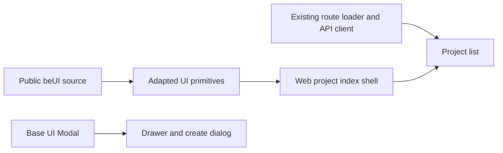

# beUI project index pilot

The authenticated Web `/projects` index and its overlays opt into a neutral
visual language. Project details, Admin, public pages and Desktop keep their
existing appearance. Logo, favicon and native icons are unchanged.

## Source and ownership

Public registry: `https://proxy.collectui.pro/api/r/beui/{name}.json`.
The [source manifest](../../packages/ui/beui-components.json) records every
retrieved file's SHA-256 and the local adaptations. The
[MIT notice](../../packages/ui/src/beui-NOTICE.md) preserves upstream attribution.
No Pro credential or component is required. Source is maintained locally;
there is no beUI runtime package or service dependency.

UI owns the button, badge, sidebar frame and navigation highlight. Web owns
links, permissions, responsive composition and translated labels. Motion is
catalog-managed; cn, Base UI and Phosphor are reused. The sidebar's unused
submenus, custom focus trap, global shortcut and variants were removed.

The route selects its shell during rendering. Scoped `.beui-theme` variables
are explicitly passed into dialog/backdrop and account-menu portals. No effect
changes document classes. Default shared tokens remain intact. CSS handles
232px desktop, 72px tablet and mobile-drawer navigation without viewport reads
during SSR. Every navigation link remains a TanStack Link.

## Behavior

Loader data, account cache isolation, native dates, AbortSignal, 50-item pages
and URL cursors keep their existing owners. Create drafts and drawer state are
local; successful writes invalidate the list. No backend, contract or database
change is required. The title form's optional submit renderer and Modal's
optional surface class preserve other consumers' defaults.

Primary actions use a 0.98 press scale with a 180ms ease-out transition.
Navigation shares a scoped moving background; badges animate label changes.
There are no perpetual effects. Reduced motion disables layout, movement and
scaling. Business stages are never displayed as network-loading animations.

## Updating the sources

Run `bunx --bun shadcn@latest view <registry URL>` for one manifest entry at a
time. Compare its files with the recorded hashes and adapted modules, then
manually port the relevant change and update the manifest and attribution.
Never put these components in `shadcn-components.json` or overwrite the adapted
files with `shadcn add --overwrite`. New upstream helpers are not automatically
accepted dependencies.

## Validation

Run UI component tests, Web tests, `bun run verify`, and the guarded real-API
browser suite described in [testing](testing.md). The beUI browser cases cover
portal themes, keyboard focus, failure/retry, empty states and viewport coverage;
the existing authenticated cases preserve pagination and account isolation.
The final run passed UI component tests (27), Web tests (108), the complete
`bun run verify` gate and all 30 browser tests. Browser execution used a dedicated
PostgreSQL 17 database and fresh loopback servers, with no production data access.
Browser verification was performed after the build gate completed.

Coverage includes 375/768/1280/1440px, English/Chinese and light/dark themes,
real creation and retry, duplicate-submit prevention, cancelled navigation,
expired sessions, SSR account isolation, pagination history, long titles,
mobile drawer focus and portal theme inheritance. The before/after gallery and
16 example-project screenshots accompany delivery. Minimum checked text
contrast is 4.95:1 in light mode and 5.91:1 in dark mode; input boundaries are
3.64:1 and 3.93:1. Generated routes, product imagery and all Logo/icon assets
have zero diff. No Rust or database schema changes were made.

The full browser suite also corrects an existing detail-page expectation: its
parallel project/task reads can report either concealed `PROJECT_NOT_FOUND` or
`PROJECT_ACCESS_DENIED` first. The test asserts either exact localized rejection
and still checks that project content and administrator navigation are absent.
No permission behavior was changed.
