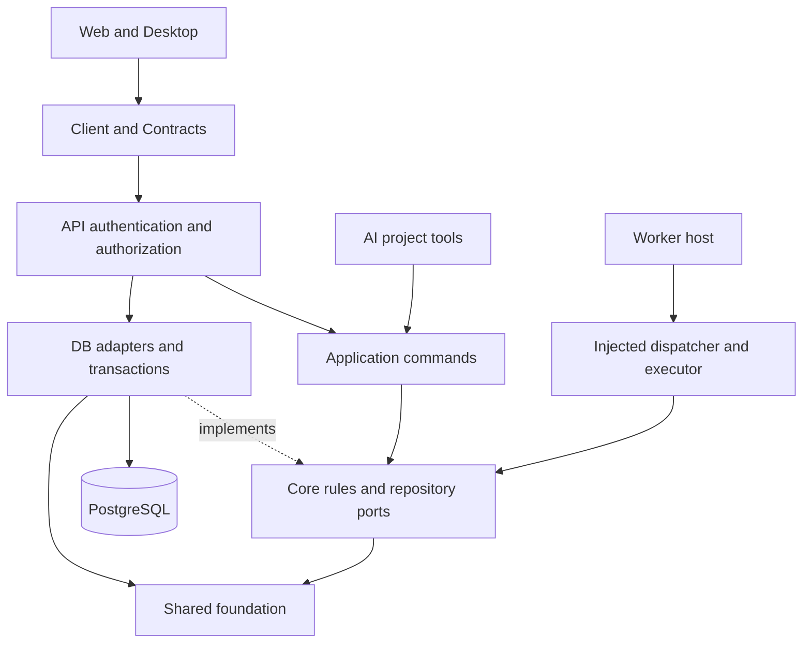

# Monolithic simplification

## Scope and measurements

This change completes retirement of the unused Workspace and Project Studio
implementations under the accepted Account-first V2 decision. It consolidates
active behavior within its owning layer, splits large modules by responsibility,
and replaces the handwritten JSX and ICU parsers with maintained parsers.

The branch starts at `bf512e2efe80be6ba507d289817424bba655a127` and targets
`canary`. Measurements use that frozen commit, not a moving branch tip.

| Measure                            | Baseline |  After | Removed | Reduction | Maximum allowed |
| ---------------------------------- | -------: | -----: | ------: | --------: | --------------: |
| Authored source, tests and tooling |   43,436 | 30,402 |  13,034 |    30.01% |          30,405 |
| Implementation excluding tests     |   31,994 | 21,732 |  10,262 |    32.07% |          22,395 |

Both 30% gates pass. The largest retained handwritten implementation module is
`packages/ai/src/index.ts` at 310 lines; every retained implementation module is
below 400 formatted lines. Physical line counts include blank lines and comments.
Files moved into domain modules remain in the count. Newly added files count too.

Excluded textual categories are reported separately; none contributes to the
reduction gates:

| Category                                                     | Baseline |  After |
| ------------------------------------------------------------ | -------: | -----: |
| Skills, including vendored and canonical skill files         |   24,839 | 24,814 |
| Generated routes, Tauri schemas and Drizzle history/metadata |   68,166 | 68,166 |
| Lockfiles                                                    |    7,511 |  6,959 |
| Documentation, including this report                         |    5,875 |  6,129 |
| Other text, configuration and assets                         |    3,956 |  3,947 |

Run the following from the repository root with Python 3. Save it outside the
checkout as `/tmp/voidmix-loc.py`, then run `python3 /tmp/voidmix-loc.py --both`.
It measures unique tracked and nonignored added files, skips deleted files and
binary data, and reproduces both frozen baselines. Once committed, every file in
the final numerator is tracked. Test classification is filename-based, matching
the frozen baseline; test configuration and shared fixtures count as implementation.

```python
import collections, pathlib, subprocess, json, sys
EXTENSIONS = {'.ts', '.tsx', '.js', '.jsx', '.mjs', '.cjs', '.rs', '.css', '.scss', '.sql'}
BASE = 'bf512e2efe80be6ba507d289817424bba655a127'
def git(*args):
    return subprocess.check_output(['git', *args])
def category(path):
    if path.startswith(('.agents/', 'skills/', '.claude/')): return 'skills'
    if path.startswith('packages/db/drizzle/') or 'routeTree.gen' in path or '/gen/' in path: return 'generated'
    if pathlib.PurePosixPath(path).name in {'bun.lock', 'Cargo.lock', 'skills-lock.json'}: return 'lockfiles'
    if path.endswith('.md'): return 'documentation'
    if pathlib.PurePosixPath(path).suffix in EXTENSIONS: return 'authored'
    return 'other'
def measure(ref=None):
    paths = git('ls-tree', '-r', '--name-only', '-z', ref).decode().split('\0') if ref else git('ls-files', '-co', '--exclude-standard', '-z').decode().split('\0')
    counts=collections.Counter(); implementation=0; modules=[]
    for path in sorted(set(paths)-{''}):
        local=pathlib.Path(path)
        if not ref and not local.is_file(): continue
        data=git('show', f'{ref}:{path}') if ref else local.read_bytes()
        try: lines=len(data.decode().splitlines())
        except UnicodeDecodeError: continue
        group=category(path); counts[group]+=lines
        if group=='authored' and '.test.' not in path and '.spec.' not in path and not path.startswith('e2e/tests/'):
            implementation+=lines; modules.append((lines,path))
    return {'totals':dict(counts),'implementation':implementation,'largest_implementation':sorted(modules,reverse=True)[:10]}
result={'after':measure()}
if '--both' in sys.argv: result['before']=measure(BASE)
print(json.dumps(result,indent=2))
```

## Removed capabilities and consumer evidence

Consumer review traced package imports, exports, API composition and renderer
calls before each removal. The canonical API already exposes Account-first V2;
the removed private implementations were not an alternate active HTTP surface.
Knip was advisory evidence and was checked against actual callers.

| Removed capability                                  | Consumer evidence and retained boundary                                                                                                                                                                                                                                                                |
| --------------------------------------------------- | ------------------------------------------------------------------------------------------------------------------------------------------------------------------------------------------------------------------------------------------------------------------------------------------------------ |
| Workspace repositories and application services     | Imports terminated in the retired Core/DB paths and their dedicated tests. The active canonical router uses account ownership and ProjectApplication. Persisted Workspace tables remain in the schema aggregate.                                                                                       |
| Project Studio, legacy projects and scheduled tasks | No canonical router registrations or active renderer callers remained. AI was the remaining legacy project consumer; its tools now use authorized ProjectApplication commands before removal of the old repository protocol. Historical tables and migrations remain.                                  |
| Legacy assets and Agent services                    | Callers belonged to the retired stack. Canonical Blob, Asset, AgentRun, review and outbox commands remain. Blob storage ports and DomainError identities are retained.                                                                                                                                 |
| Auth/Mail settings administration factories         | Only API composition instantiated them; no route or other caller consumed modules.settings. Runtime auth and mail read effective settings directly from retained repositories. Settings decoding, defaults, omission/set/reset, redaction and no-op audit behavior remain covered.                     |
| Admin test-mail method and template                 | Their only capability consumer was the retired Mail settings administration factory. Runtime verification, password reset and welcome messages remain; current-configuration tests now exercise sendWelcome with the existing assertions. Historical audit-action values remain persisted.             |
| Desktop legacy Pi bridge and sync queue             | No active renderer invoked the removed Pi lifecycle or queue methods. Settings still consumes folder authorization, now isolated in a typed renderer bridge and Rust folder module; its input envelope is corrected.                                                                                   |
| Sidebar, Menubar and exclusive UI trees             | Repository import review found no application or Storybook consumers. Exclusive Dialog, Sheet, Tooltip, Skeleton, Separator and mobile-hook code, dependencies and shadcn regeneration entries were removed together. Active primitives preserve roles, refs, data slots, focus and keyboard behavior. |
| Cache helpers and unused facades                    | Generic operations had no callers; forget lost its final caller when the unused settings invalidation callback was removed. Retained cache behavior is remember plus Better Auth raw storage. Desktop API-error translation and Mail renderTemplate had no active callers.                             |
| FieldError error-array normalization                | All active consumers pass localized children. The unused errors prop is removed; null rendering, role and children semantics remain tested.                                                                                                                                                            |

Knip now scopes source projects to repository workspaces, excludes nested
worktrees, and understands the source entries behind the built shared-package
exports. Production-mode findings were not used to remove API entries: Knip's
production entry filtering can omit entries without a production marker.

## Retained structure and flow



- Contracts keep an explicit public procedure tree over account, project, asset,
  Agent and review modules. Client and API share isMutationProcedure for HTTP
  method classification.
- Application commands share context, resource loading and capability checks;
  domain commands retain guard ordering and transaction ownership. API shares
  error conversion and request context without moving authorization into clients.
- DB adapters separate identity, audit, settings and canonical V2 domains.
  Memory and PostgreSQL share settings interpretation, inheritance and mutation
  logic; the adapters retain their own cloning and transaction mechanics.
- Schema source is split by domain behind an explicit aggregate. Table names,
  columns, indexes, constraints and migration history are preserved. Generation
  reports no schema changes. ADR-0013 replaces the former single-file rule.
- Tooling separates catalog comparison, source inspection and reporting.
  oxc-parser owns JSX/TypeScript parsing; FormatJS owns ICU syntax through the
  i18n testing facade. Both are direct catalog-managed dependencies.
- Policy findings, manifest validation, subprocess fixtures and command setup
  share local helpers. Verification gates remain explicitly ordered. Every
  workspace retains its independent Vitest configuration over shared defaults.
- Web forms share feedback and submission composition. Desktop styles are
  divided by rendered area after unused selectors are removed. Shared UI slot
  construction preserves caller prop precedence and forwarding.

## Interface compatibility

Active HTTP/RPC paths, request/response shapes, native Date values and error
envelopes remain unchanged. Canonical V2 names remain stable. Removed exports
were private package interfaces whose consumers were retired or migrated in this
change; no compatibility wrappers perpetuate the old architecture.

Authorization, missing-resource behavior, organization capability limits,
administrator/self-suspension guards, audit creation, atomic Agent/outbox writes,
cancellation and settings inheritance retain focused coverage. Queue creation,
cancel and retry are exercised through the API. AI event completion,
cancellation and cleanup have characterization tests.

Desktop retains folder authorization but removes unused native Pi commands and
their exclusive permissions/dependencies. This is not a database migration or a
production data operation. Shared continues to expose built ESM entries and its
public-entry tests remain in the verification gate.

## Verification results

Validation ran with Bun 1.4.0 and local Node 22.21.1 on macOS. The declared
production server runtime remains Node 24.18.0; this run does not establish
execution on that exact production Node version.

Before editing, all 17 test-bearing workspaces passed 614 tests, extending the
plan's initial 324-test subset. After refactoring, 599 tests pass. Dedicated tests
were removed with retired capabilities; repetitive retained tests use named
parameterized cases and local fixtures. New characterization covers changed
boundaries. Counts alone are not an assertion-equivalence proof; the final diff
was reviewed for lost retained assertions and formatting-only reductions.

| Command/check                             | Result                                                                                                                                                                       |
| ----------------------------------------- | ---------------------------------------------------------------------------------------------------------------------------------------------------------------------------- |
| bun run verify --verbose                  | Passed: i18n, policy, formatting, lint, shared build, workspace type checks, 599 tests in 17 workspaces, builds and Web/API Nitro Node runtime probes. Lint warnings remain. |
| bun run test:unit                         | Passed: 539 tests; 17 workspace scripts completed.                                                                                                                           |
| bun run test:integration                  | Passed: 18 tests; 17 workspace scripts completed.                                                                                                                            |
| bun run test:component                    | Passed: 47 tests; 17 workspace scripts completed.                                                                                                                            |
| bun run test:coverage                     | Passed: 599 tests; 17 workspace scripts completed.                                                                                                                           |
| VOIDMIX_E2E_PORT=3410 bun run test:e2e    | Passed: 10 tests across Web, Admin and Desktop in 18.3 seconds.                                                                                                              |
| cargo fmt --check                         | Passed in apps/desktop/src-tauri.                                                                                                                                            |
| cargo check                               | Passed in apps/desktop/src-tauri.                                                                                                                                            |
| cargo clippy --all-targets -- -D warnings | Passed in apps/desktop/src-tauri.                                                                                                                                            |
| bun run generate                          | No schema changes, nothing to migrate.                                                                                                                                       |
| Generated artifact diff                   | No tracked drift in Drizzle history or Web/Desktop routeTree.gen.ts after generation/builds.                                                                                 |
| git diff --check                          | Passed.                                                                                                                                                                      |

Layer counts overlap: the unit exclusion targets the exact component.test basename,
while the component substring filter also selects suffixed component tests. They
are independent command results, not disjoint totals. Workspaces without tests in
a selected layer may legitimately report no matching tests.

Characterization includes project ownership and access failures; settings
omission/set/reset, defaults, secret redaction, no-op audit and adapter parity;
blob validation, transaction rollback and Agent cancellation; JSX text,
attributes, conditional expressions, templates, ICU plural/apostrophe handling
and diagnostic positions. Component/router and browser tests cover authentication,
forms, loading/error presentation, navigation, theme, locale and keyboard behavior.

Database tests use memory and fake PostgreSQL executors. Runtime probes serve
HTTP routes without production database queries. Desktop E2E runs the browser
preview; native validation compiles/checks Rust, not an installer release or
all supported operating systems. No merge or deployment is included.
