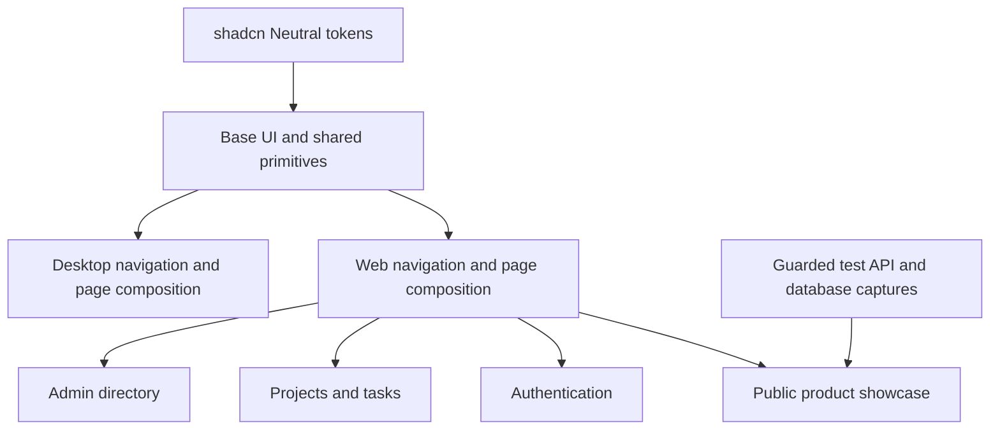

# Neutral UI delivery

Voidmix uses the official shadcn base-nova Neutral theme across public pages,
authentication, projects, Admin and Desktop. Logo and icon assets are unchanged.
The baseline for this change is canary `2c14e20`.

## Implementation

One Web shell replaces the route-specific beUI pilot. Shared stock primitives
provide Tabs, Dialog, Sheet, Table, Checkbox, ToggleGroup, Alert, Empty and
Skeleton. Application wrappers retain naming, safe button types, busy dismissal
protection, lazy Toast and existing data ownership. Motion is no longer a direct
dependency. The missing hooks alias now resolves in the shadcn CLI.
Desktop navigation derives its selected item from the current route pathname,
including nested project routes, so the WebView shell follows navigation and
history updates.

No HTTP/RPC, schema, authorization or loader contract changed. Existing URL
search, session isolation, native dates, cancellation, Admin store lifetimes and
Desktop preference restoration remain in their owning layers.

## Product images

`bun run --cwd e2e capture:product` uses guarded synthetic accounts and loopback
servers selected by `VOIDMIX_E2E_PORT`. It produces 32 local WebP files: four
views, two locales, two themes and two sizes. The browser encodes the screenshots,
so no new image-processing dependency is needed. Measured dimensions are written
to the marketing image manifest to reserve layout space. Old PNGs are removed
only after the new capture completes. No runtime uses the example account data.

The hero eagerly loads its selected view. Other images load lazily. Picture
sources choose actual mobile captures and match system dark mode before React
hydrates. Explicit user theme preferences take precedence.

## Verification

The baseline passed 27 UI component tests, 108 Web tests and 85 Desktop tests.
Retired beUI animation/highlight checks are replaced by shared primitive and
application navigation coverage; native button, focus, translated status, failed
creation and duplicate-submit checks remain.

Final results on September 29, 2026:

| Gate                                        | Result                                                                                          |
| ------------------------------------------- | ----------------------------------------------------------------------------------------------- |
| UI focused component tests                  | 26 passed                                                                                       |
| Web tests                                   | 107 passed                                                                                      |
| Desktop tests                               | 85 passed                                                                                       |
| `bun run verify`                            | Passed: i18n, policy, formatting, lint, workspace checks, tests, builds, Web/API runtime probes |
| Browser E2E with real API and PostgreSQL 17 | 35 passed, 3 workers, 1.2 minutes                                                               |
| `bun run desktop:build`                     | Passed; macOS arm64 application and DMG                                                         |
| shadcn CLI alias resolution                 | `info --cwd packages/ui --json` resolves shared component paths                                 |

Web browser captures cover 375 zh dark, 768 en light, 1280 zh light and 1440 en
dark. Desktop renderer captures cover 800 zh dark, 1120 en light and 1440 zh
light. These are representative combinations, not every viewport multiplied by
every locale and theme. The product-image capture itself covers both locales and
themes at both desktop and mobile sizes.

Browser checks cover actual creation/persistence, failed submission with input
retention, duplicate submission prevention, cancellation, expired login, account
isolation, Admin filtering and partial failure, pagination/history, keyboard Tabs,
drawer/dialog focus restoration, reduced motion, matching image sources and
horizontal containment. Expected API failures are deliberately exercised. The
homepage tests reported no uncaught page errors or hydration warnings.
Admin batch coverage deliberately fails one mutation while the other reaches the
real API, then reloads to verify that the successful write persisted.

The macOS application was launched from this checkout's bundle. Native checks
covered settings navigation, collapsed Logo visibility, light/dark theme controls
and hiding the window while the process remained alive. The renderer was tested
at 800px and the native `minWidth: 800` configuration is unchanged. The computer
automation's native drag operation was unavailable, so no native resize result
is claimed. Rust source and native permissions did not change.

The original 27/108 UI/Web totals included a retired beUI-only highlight test and
a duplicate beUI submission variant. Their owning implementations were removed;
safe button defaults, ref forwarding, focus and failed-submit assertions remain.

## Visual evidence

These comparisons show the upper page region at a consistent rendered width;
long pages are cropped vertically for legibility. All sample records are
synthetic. Record order may differ between test runs. Historical before captures
are reused; the project-list before image is the delivered beUI pilot, while
the other before images predate the Neutral migration.

| Page           | Before and after                               |
| -------------- | ---------------------------------------------- |
| Homepage       | [Comparison](./neutral-evidence/home.webp)     |
| Project list   | [Comparison](./neutral-evidence/projects.webp) |
| Authentication | [Comparison](./neutral-evidence/login.webp)    |
| Admin          | [Comparison](./neutral-evidence/admin.webp)    |
| Desktop        | [Comparison](./neutral-evidence/desktop.webp)  |

The full local gallery contains 74 responsive, overlay and failure-state browser
captures, plus a native window capture. Reproduce browser captures through
`bun run test:e2e`; Playwright writes them to `e2e/test-results/`. Product assets
are regenerated separately with `bun run --cwd e2e capture:product` against
already-running loopback servers and the guarded test database.

Final scope review confirmed no changes to Logo, favicon or application icon
assets, generated route trees, HTTP/RPC contracts, backend implementation,
database schemas or migrations. The saved pre-pilot neutral draft remains intact.
